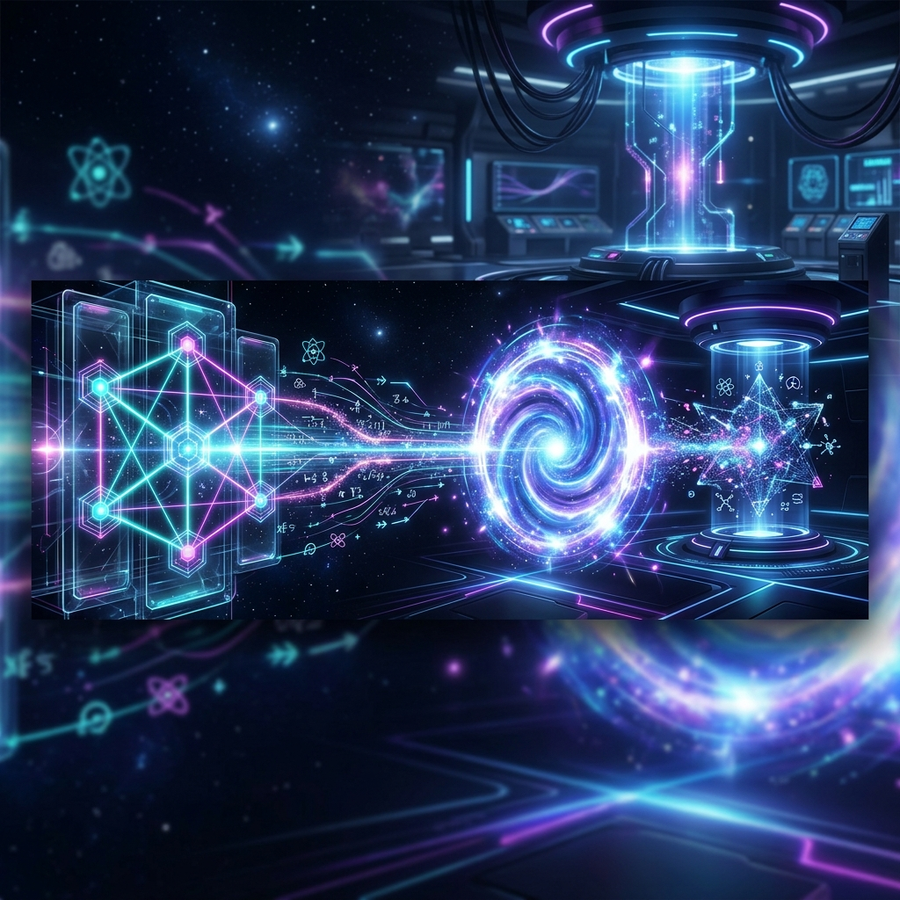

# 🏺 Tılsım-ı Hendese: Kuantum Geçidi Rehberi

<p align="center">
  
</p>

[](https://opensource.org/licenses/MIT)
[](https://www.python.org/)
[](https://qiskit.org/)
[]()

**Tılsım-ı Hendese (Kuantum-Geçidi)**, kadim bilgelik ile siber-kozmik mantığın kesiştiği noktada, **Nur-Zerre** (Qubit) transferi ve **Âlem-i Berzah** (Superposition) fenomenlerini modelleyen bir dijital simya laboratuvarıdır.

---

## 📜 Âlem-i Berzah Sözlüğü (Exotic Lexicon)

Bu projede kullanılan terminoloji, kuantum mekaniğini bir siber-ritüel olarak ele alır:

| Egzotik Terim | Teknik Karşılık | Kavramsal Köken |
| :--- | :--- | :--- |
| **Normal Nur-Zerre** | Single Qubit | Tekli bilginin en küçük birimi. |
| **Küllî Nur-Zerre** | Multi-Qubit System | Kolektif bilginin oluşturduğu geniş yapı. |
| **Âlem-i Berzah** | Superposition | İki kesin gerçeklik arasındaki aracı alem. |
| **Râbıta-i Küll** | Entanglement | Her şeyin birbiriyle olan görünmez bağı. |
| **Nazar-ı Tezahür** | Measurement | Gözlemcinin bakışıyla gerçeğin şekillenmesi. |
| **Tılsım-ı Hendese** | Quantum Circuit | Geometrik bir kuantum büyüsü/devresi. |
| **Miftâh-ı Esrar** | Logic Gate | Bilginin sırlarını açan anahtar. |
| **Tayy-i Mekân** | Teleportation | Mesafeyi yok sayarak anlık yer değiştirme. |

---

## 🏗 Simya Laboratuvarı Yapısı

| Modül | Tasvir | Konum |
| :--- | :--- | :--- |
| 📚 **Öğretiler** | Nur-Zerre manipülasyonu üzerine görsel dersler. | `dersler/` |
| 🧪 **Simya** | **Tayy-i Mekân**, **Küllî Tayy-i Mekân**, **Râbıta-i Küll**, **QKD**. | `kaynak/` |
| 🔮 **Kahin** | Âlem-i Berzah'tan gelen metaforik tecelliler. | `kaynak/kuantum_kahini.py` |
| 🧪 **Küllî Tayy** | Çoklu qubitlerin (N-Qubit) eşzamanlı aktarımı. | `kaynak/multi_qubit_teleportasyon.py` |
| 🖼 **Tasvir** | Tılsım-ı Hendese şemaları ve görsel kayıtlar. | `gorseller/` |
| 🕹 **Mihrab** | **İnteraktif Ritüel Paneli**. | `kuantum_gecidi.py` |

---

## 🧐 Tayy-i Mekân Nedir?

Bir **Nur-Zerre**'nin üzerindeki ilahî bilginin (durumun), zerre hareket etmeden, **Râbıta-i Küll** ve klasik işaretler kullanılarak başka bir noktada **zuhur etmesi** işlemidir.

### Küllî Tayy-i Mekân (Multi-Qubit)
Bu projede sadece tekli zerreleri değil, **kolektif Nur-Zerre yapılarını** da (Multi-Qubits) aynı anda aktarabilirsiniz. `kaynak/multi_qubit_teleportasyon.py` modülü, $n$ adet zerreyi paralel kanallar üzerinden aynı yüksek sadakatle (fidelity) hedefe ulaştırır.

---

## 🛡️ Sırların Paylaşımı: QKD (BB84)

Klasik mühürler kırılabilir, lakin **Kozmik Yasalar** (No-Cloning) ile korunan bir anahtar asla gizlice dinlenemez. Alice ve Bob, Nur-Zerreleri rastgele bazlarda takas ederek sarsılmaz bir **Sırdaşlık Bağı** kurarlar.

---

## 🧪 Gerçek Dünya Kaosu: Hata Deryası (NISQ)

Laboratuvarın dışındaki gürültülü derya, Nur-Zerrelerin saflığını bozar:
1.  **Nifak-ı Zerre (Decoherence):** Çevrenin nazarıyla kuantum saflığının yitirilmesi.
2.  **Kusur-u Miftâh (Gate Inaccuracy):** Geometrik anahtarların %100 kusursuz olmaması.

---

## 🗺 Yol Haritası (Roadmap) - Gnosis Achieved

- [x] **Nur-Zerre Protokolü:** Standart Işınlanma (Qiskit 1.0+).
- [x] **Sadakat Analizi:** Fidelity ölçüm ve doğrulama araçları.
- [x] **Hata Deryası Simülasyonu:** Gürültü modelleri ve NISQ analizi.
- [x] **Râbıta-i Küll Takası:** Kuantum tekrarlayıcılar için Dolanıklık Takası.
- [x] **Küllî Tayy-i Mekân:** Çoklu qubitlerin (Multi-Qubit) ışınlanması.

---

## 🚀 Başlangıç

### 1. İksirleri Hazırlayın
```bash
pip install -r requirements.txt
```

### 2. Ritüel Paneli Başlatın
```bash
python kuantum_gecidi.py
```

---

## 👨‍💻 Kuantum Mimarı

Bu siber-kozmik yapıtın tasarımcısı ve dalga fonksiyonlarının koordinatörü:

**Bahattin Yunus Çetin**  
*IT Architect*

| Tasvir | Yol |
| :--- | :--- |
| **Zuhurât (GitHub)** | [github.com/arch-yunus](https://github.com/arch-yunus) |
| **Bağlantı (LinkedIn)** | [linkedin.com/in/bahattinyunus](https://www.linkedin.com/in/bahattinyunus/) |

---

<p align="center">
  © 2026 - Tılsım-ı Hendese: Gerçekliğin Yeniden İnşası
</p>