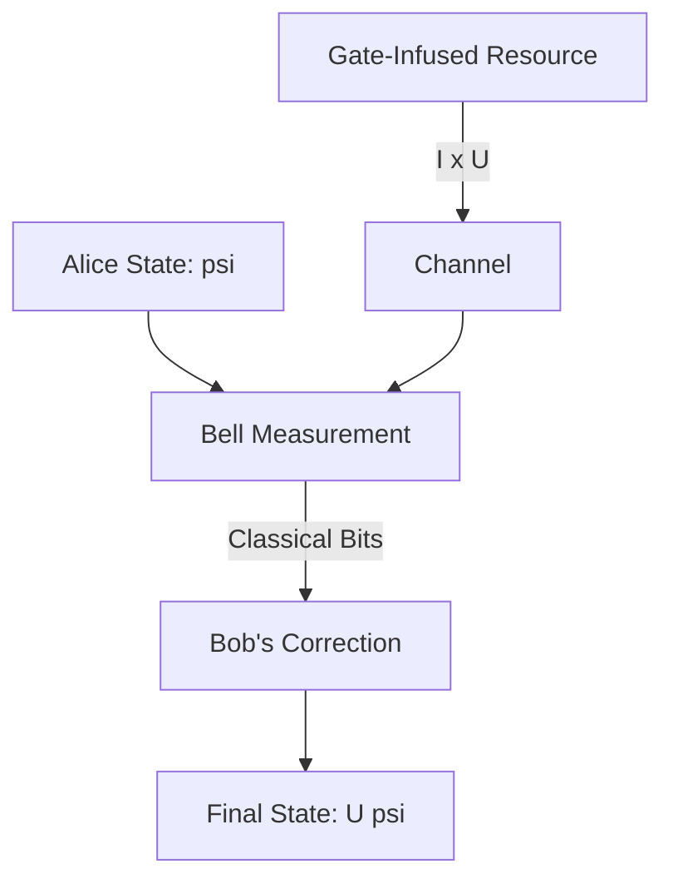
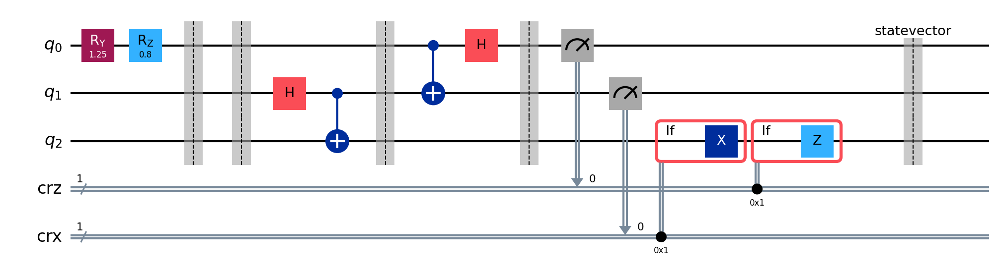
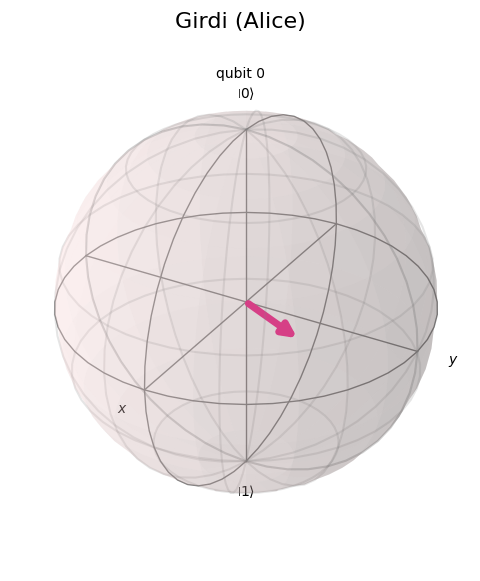
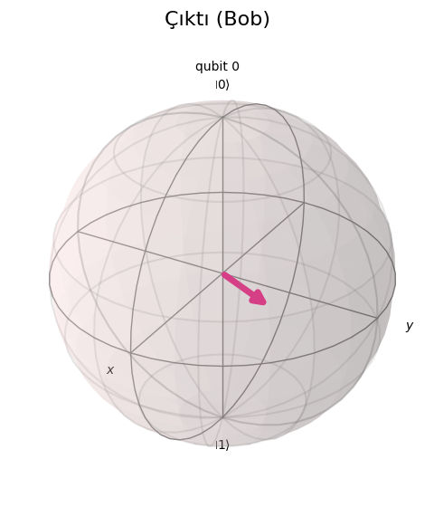
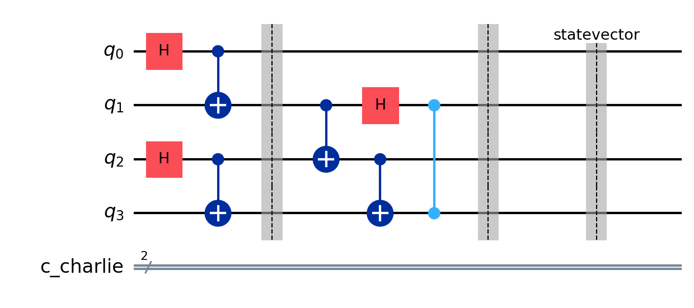
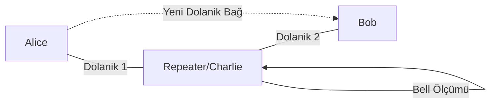
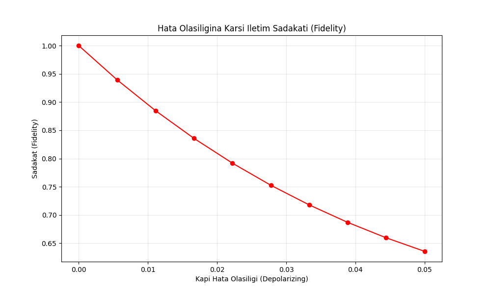

# 🌌 Kuantum-Geçidi: Kuantum Işınlanma Rehberi

[](https://opensource.org/licenses/MIT)
[](https://www.python.org/)
[](https://qiskit.org/)
[]()

**Kuantum-Geçidi**, kuantum mekaniğinin en büyüleyici fenomenlerinden biri olan **Kuantum Işınlanma** (Quantum Teleportation) protokolünü modern yazılım perspektifiyle modelleyen, simüle eden ve öğreten kapsamlı bir eğitim platformudur.

> [!NOTE]
> Bu depo, "ışınlanma" kavramını bilim kurgudan çıkarıp, kuantum bilgi kuramı çerçevesinde somut bir algoritma olarak ele alır.

---

## 🏗 Repository Structure

| Module | Description | Location |
| :--- | :--- | :--- |
| 📚 **Lessons** | Interactive Jupyter Notebooks (01-05). | `dersler/` |
| 🛠 **Source** | Core logic, **Gate Teleportation**, **Noise Analysis** and **Entanglement Swapping**. | `kaynak/` |
| 🖼 **Gallery** | Circuit diagrams and visualization results. | `gorseller/` |
| 📖 **Guide** | Detailed setup and usage instructions. | [KULLANIM_REHBERI.md](KULLANIM_REHBERI.md) |

---

## 🧐 Nedir Bu Kuantum Işınlanma?

Kuantum ışınlanma, bir parçacığın üzerindeki kuantum bilgisinin (durumunun), parçacığın kendisi hareket etmeden, dolanıklık ve klasik iletişim kullanılarak başka bir parçacığa aktarılmasıdır.

### Temel Sütunlar
1.  **No-Cloning (Kopyalanamazlık):** Bir kuantum durumu kopyalanamaz; veri aktarıldığında orijinal kaynaktaki bilgi yok olur.
2.  **Süperpozisyon:** Verinin aynı anda hem 0 hem 1 olasılığını taşıma yeteneği.
3.  **Dolanıklık (Entanglement):** Einstein'ın "uzaktan ürkütücü etkileşim" dediği, parçacıkların kader birliği.

---

## 🔬 Matematiksel Doğrulama: Yoğunluk Matrisleri

Işınlanma başarısını doğrulamak için Alice'in hazırladığı durum ile Bob'un elde ettiği durumu **Yoğunluk Matrisi** ($\rho$) üzerinden karşılaştırırız.

### Kısmi İz (Partial Trace) Analizi
Çoklu qubit sisteminden belirli bir qubitin ($q_i$) durumunu çekmek için kısmi iz operatörünü kullanırız:
$$\rho_{dest} = Tr_{other}(\rho_{total})$$

**Sadakat (Fidelity) Ölçümü:**
İki kuantum hali ($\rho$ ve $\sigma$) arasındaki benzerlik şu formülle hesaplanır:
$$F(\rho, \sigma) = \left( Tr \sqrt{\sqrt{\rho} \sigma \sqrt{\rho}} \right)^2$$
İdeal ışınlanmada $F=1.0$ olmalıdır. Projemizdeki `AnalizAraclari` bu doğrulamayı her testte otomatik olarak gerçekleştirir.

---

## 🧪 Kapı Işınlanması (Gate Teleportation)

Basit veri aktarımının ötesinde, ışınlanma kanalı üzerinden **kuantum işlemciler** arası kapı işlemleri (gate operations) taşınabilir. Bu, evrensel kuantum hesaplamanın ve hata toleranslı (fault-tolerant) mimarilerin temelidir.

### Teknik Mantık: $(I \otimes U)|\Phi^+\rangle$
Alice ve Bob arasında sadece bir Bell durumu paylaşmak yerine, Bob kendi qubitine önceden bir $U$ kapısı uygular. Teleportasyon gerçekleştiğinde, Alice'in $| \psi \rangle$ durumu Bob'a geçtiğinde otomatik olarak $U| \psi \rangle$ haline gelir.



---

## 🧪 Teknik Derin Bakış

### Protokolün Matematiği

Alice, elindeki bilinmeyen $| \psi \rangle$ durumunu Bob'a göndermek ister:

$$| \psi \rangle = \alpha | 0 \rangle + \beta | 1 \rangle$$

Süreç şu adımları izler:

1.  **Dolanıklık Hazırlığı:** Alice ve Bob bir Bell çifti paylaşır: $| \Phi^+ \rangle = \frac{1}{\sqrt{2}} (| 00 \rangle + | 11 \rangle)$.
2.  **Alice'in Etkileşimi:** Alice kendi qubitlerini birbirine bağlar ve Bell ölçümüne hazırlar.
3.  **Ölçüm Çöküşü:** Alice ölçüm yaptığında, Bob'un elindeki qubit Alice'in sonucuna göre 4 olası durumdan birine girer.
4.  **Klasik Düzeltme:** Bob, Alice'den gelen 2 klasik biti kullanarak kendi qubitine $X$ ve/veya $Z$ kapıları uygular ve orijinal $| \psi \rangle$ durumunu %100 sadakatle (fidelity) elde eder.

---

## 🖼 Görsel Galeri (Showcase)

Bu proje, karmaşık kuantum süreçlerini anlamayı kolaylaştırmak için otomatik görselleştirmeler üretir:

| Devre Şeması | Girdi Durumu (Alice) | Çıktı Durumu (Bob) |
| :---: | :---: | :---: |
|  |  |  |

> [!TIP]
> `kaynak/isinlanma_test.py` dosyasını çalıştırarak kendi görsel çıktılarınızı anında üretebilirsiniz.

---

## 🚀 Başlangıç

### 1. Kütüphaneleri Kurun
```bash
pip install -r requirements.txt
```

### 2. İlk Işınlanma Devresini Çalıştırın
```bash
python kaynak/isinlanma_test.py
```

---

## 🗺 Yol Haritası (Roadmap)

- [x] Temel Işınlanma Protokolü (Qiskit 1.0+)
- [x] Fidelity (Sadakat) Analiz Aracı
- [ ] **Gürültü Modelleri:** Gerçek kuantum cihazlarındaki (decoherence) hataların simülasyonu.
- [ ] **Kuantum Tekrarlayıcılar:** Uzun mesafe kuantum ağları için modelleme.
- [ ] **Multi-Qubit Teleportasyon:** Birden fazla qubitin aynı anda aktarımı.

---

## 🚀 Geleceğin Kuantum İnterneti: Tekrarlayıcılar ve Takas

Kuantum ışınlanma, sadece tek bir qubiti aktarmakla kalmaz; küresel ölçekte bir **Kuantum İnterneti** kurmanın temel taşıdır.

### Dolanıklık Takası (Entanglement Swapping)
Fiziksel fiber optik kablolarda kuantum bilgisi mesafe arttıkça kaybolur. Klasik yükselticiler kuantum bilgisini kopyalayamadığı için (No-Cloning), bu sorunu **Dolanıklık Takası** ile aşarız.

**Teknik Akış:**
1.  Alice ve Charlie bir dolanık çift paylaşır.
2.  Bob ve Charlie de başka bir dolanık çift paylaşır.
3.  Charlie (ara düğüm), elindeki iki qubit üzerinde bir **Bell Ölçümü** gerçekleştirir.
4.  Sonuç: Alice ve Bob, fiziksel olarak hiç etkileşime girmeden birbirleriyle dolanık hale gelirler.

| Dolanıklık Takası Devresi |
| :---: |
|  |



---

## 🛡️ Güvenlik ve Protokol Karşılaştırması

| Özellik | Kuantum Işınlanma | Kuantum Anahtar Dağıtımı (QKD) |
| :--- | :--- | :--- |
| **Amaç** | Kuantum verisini (qubit) aktarmak. | Güvenli şifreleme anahtarı üretmek. |
| **Yöntem** | Dolanıklık + Klasik Kanal. | Tek foton gönderimi veya Dolanıklık. |
| **Güvenlik** | No-Cloning + Dolanıklık Kontrolü. | Ölçümle bozulan durumların tespiti. |
| **Uygulama** | Kuantum Ağları & Hesaplama. | Siber Güvenlik & Bankacılık. |

---

## 🧪 Gerçek Dünya Kısıtlamaları: NISQ Çağı

Laboratuvar ortamının dışına çıktığımızda kuantum dünyası oldukça zorlu hale gelir. Modern kuantum bilgisayarlar **NISQ** (Noisy Intermediate-Scale Quantum) olarak adlandırılır:

1.  **Decoherence (Yitirim):** Qubitlerin çevresiyle etkileşime girip kuantum özelliklerini kaybetmesi (T1 ve T2 süreleri).
2.  **Gate Fidelity (Kapı Sadakati):** Kullanılan kuantum kapılarının (H, CNOT) %100 kusursuz olmaması. Projemizde yer alan `gurultu_analizi.py` aracıyla bu hataların sadakat üzerindeki etkisini aşağıdaki grafik üzerinden görebilirsiniz:

| Sadakat Kaybı (Noise) |
| :---: |
|  |

3.  **Haberleşme Gecikmesi:** Bob'un Alice'den gelecek klasik biti bekleme zorunluluğu, hızı klasik limitlere çeker.

---

## ❓ Sıkça Sorulan Sorular (SSS)

**S: Bu protokol ile ışıktan hızlı iletişim kurulabilir mi?**  
**C:** Hayır. Bob, Alice'den gelen klasik anahtarı (telefon veya fiber hattı üzerinden) almadan qubitini çözemez. Bu durum **No-Communication Theorem** ile korunur.

**S: Bir insanı ışınlayabilir miyiz?**  
**C:** Teorik olarak atomik seviyedeki tüm kuantum bilgisini ışınlamak gerekirdi. Ancak bir insanın içerdiği devasa bilgi miktarı ve bu bilginin dolanıklığını koruma zorluğu, bunu günümüz ve öngörülebilir gelecek teknolojisi için imkansız kılar.

---

## 📜 Tarihçe ve Kilometre Taşları

Kuantum ışınlanma, teorik bir öngörüden küresel ölçekte deneylere uzanan büyük bir yolculuktur:

*   **1993 - Teorik Temel:** Charles Bennett ve ekibi, kuantum ışınlanmanın protokolünü ilk kez teorik olarak ortaya koydu.
*   **1997 - İlk Deney:** Anton Zeilinger ve ekibi (Viyana Üniversitesi), fotonların polarizasyon durumunu ilk kez başarıyla ışınladı.
*   **2004 - Atomik Işınlanma:** Innsbruck ve NIST ekipleri, bilgiyi atomdan atoma aktarmayı başardı.
*   **2017 - Micius Uydusu:** Jian-Wei Pan liderliğindeki ekip, Tibet'teki bir istasyondan yörüngedeki **Micius** uydusuna **1,400 km** mesafeden foton ışınlayarak rekor kırdı.
*   **2020+ - Kuantum İnterneti:** Günümüzde teleportasyon, kıtalararası kuantum ağlarının (Quantum Internet) kalbi olarak kabul edilmektedir.

---

## 📜 Kaynakça & Teşekkür

1.  **Bennett, C. H. et al.** (1993). "Teleporting an unknown quantum state via dual classical and Einstein-Podolsky-Rosen channels". [Physical Review Letters].
2.  **Qiskit Documentation** - [docs.quantum.ibm.com](https://docs.quantum.ibm.com/)

---

## 🤝 Katkıda Bulunma

Bu bir eğitim projesidir ve her türlü katkıya açıktır!
1. Depoyu çatallayın (Fork).
2. Yeni bir özellik dalı (Feature Branch) açın.
3. Değişikliklerinizi kaydedin ve bir Pull Request oluşturun.

---

**[Yunus Çetin - 2026]** | [GitHub](https://github.com/arch-yunus)